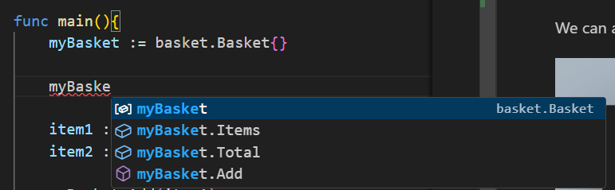

# Packages

One of the things that we will have noticed with our basket, is that we've got all the code in one file. This makes our code less modular, hard to read, and hard to refactor.

One way we counteract this is to use *packages*

You are already using packages though, so this isn't special. When we use 

```import "fmt"```

we are importing the "fmt" *package*. We then use the package like so:

```fmt.Println("Hi")```

So *Println* is a function we can access and use in the fmt *package*.

## Inspecting the code

You'll see that we have two folders named basket and helpers. Inside the basket folder you'll see we have 2 files, basket and item.

### basket.go


So far we've probably only used *package main*, but here you can see that we have defined a new package, called *basket*.

This is how we will refer to the package. 

#### NOTE: By convention the package has the same name as the folder it is in.

We can see the basket imports something we've not seen before in "shopping/helpers" - we'll come back to this.

Further down we can see Basket has a struct and a few methods (calculateTotal, Add and Remove).


So far, all pretty normal!

### Why are some methods in a different case?

The eagle-eyed will be wondering if I was just lazy in naming my methods. Nothing could be further from the truth - in Go methods, variables, structs, fields, functions that start with an uppercase letter are considered *public* - that is they are available to be called from outside the package, like Println is in the fmt package.

We can access these by using the dot notation, for example:


so *basket* is the package and *Basket* is the struct.

If the method, struct, field, function, variable starts with a lowercase letter then it is *private*. This means it can only be called from within the package itself. So, only those other methods, functions etc inside the basket package can call *calculateTotal*.

You can try this in main.go. as you start typing myBasket it will show you the fields, function, and methods you have access to:



Notice you cannot access *calculateTotal*, as this is a private method, but you can see it is accessible inside the basket package (line 22 and 27):


### items.go

Now, if we look in the items.go file, we'll see that it also defines it's package as "basket" and contains a single struct:


Again, this struct is Public, as are the Fields.

## Using the package

Let's look at main.go now, and not worry about the implementation of the basket package itself.


We decalre this to be package main, and we can see a new import statement *shopping/basket*.

You can think of this as a signpost for Go to tell it where the package is.

The first part "shopping" is the name I gave the Go project when I did *go mod init*:

```go mod init shopping```

You can see the name in the go.mod file.

This sets the base path for this Go project (the root). Everything else build from this, so our *basket* package is in the basket folder.

So the format is 

```import "go mod name/folder name"```

We can now reference it by using the package name *basket*:


# Task

Add a new method to the Basket to empty all items from the basket